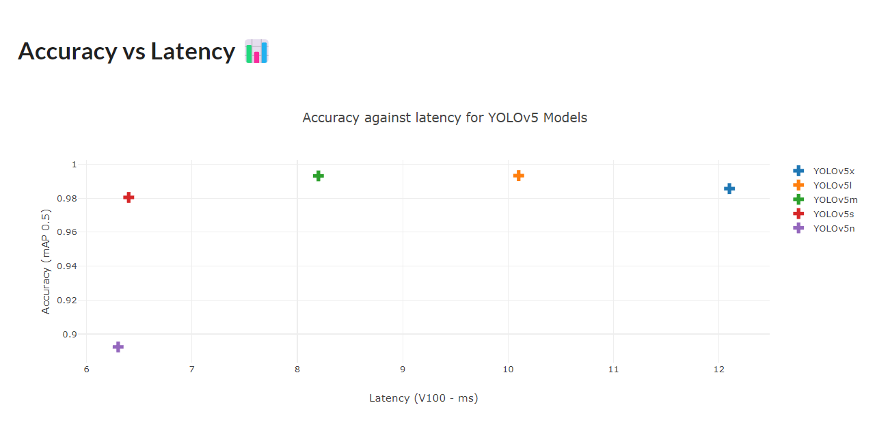
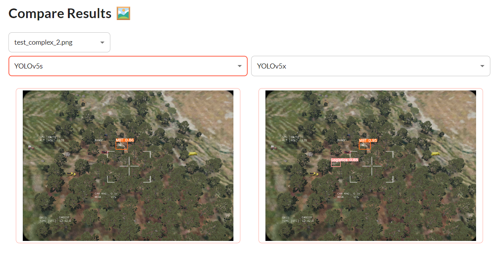

# 🛰️ Vehicle Image Recognition

<p align="center">
  
</p>

## Comparing the performance of different YOLOv5 models on drone imagery

In this application, we compare the performance of different YOLOv5 models for detecting and recognizing 
military vehicles in drone imagery.

<p align="center">
  
</p>

Learn more about this project <a href="https://github.com/AlexandreSajus/Military-Vehicles-Image-Recognition" target="_blank">here</a>.

<p align="center">
  
</p>

<p align="center">
  
</p>

## How to use

1. Clone the repository

```bash
git clone https://github.com/Avaiga/demo-vehicle-image-reco.git
```

2. Install the required packages

```bash
pip install -r requirements.txt
```

3. Run the application

```bash
python app.py
```